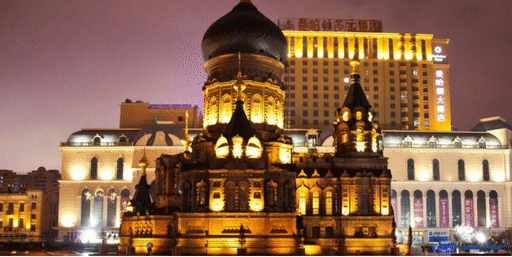

### 一个[WebGL][https://developer.mozilla.org/zh-CN/docs/Web/API/WebGL_API]图片切换效果。

效果如图：

参数：

- `el`[DOM]:绑定的`DOM`元素，默认是`body`。

- `images`[Array]:需要切换的图片地址的数组，两张。
- `width`[Number]：宽。
- `height`[Number]：高。
- `transImg`[String]:切换效果的图片url，默认是一张大理石效果的图片。
- `vertexSrc,ragmentSrc`[String]:包含GLSL程序代码的字符串。

方法：

- `on()` 变化图片为第二张。
- `off()`变化图片为第一张。
- `toggle()`切换图片。
- `onComplete()`动画结束时的回调。

示例：

```javascript
let els = document.querySelectorAll('li');
let arr = [];
for (let i = 0, len = els.length; i < len; i++) {
    let test = new GLTransition({
        el: els[i],
        images: [
            './assets/1.jpg',
            './assets/2.jpg',],
        width: 1024,
        height: 512,
    });
    test.GLTrans();

    els[i].querySelector('canvas').addEventListener('click', function (params) {
        //切换
        test.toggle();
    });
    els[i].querySelector('canvas').addEventListener('mouseenter', function (params) {
        test.on();
    });
    els[i].querySelector('canvas').addEventListener('mouseleave', function (params) {
        test.off();
    });
};
```


